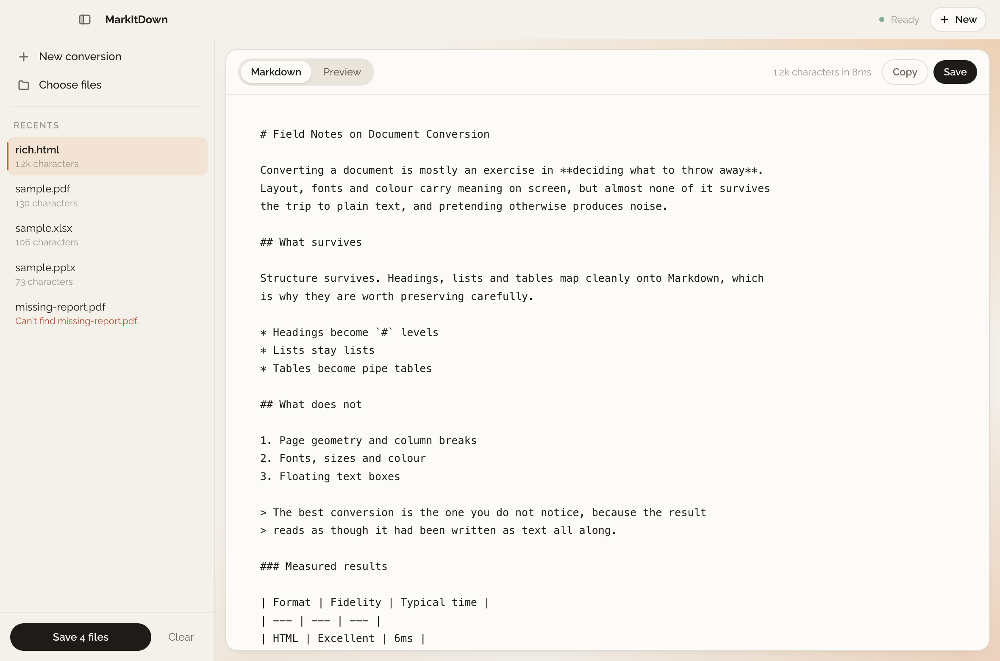

<div align="center">


# MarkItDown

**Turn documents and links into clean Markdown. Entirely on your Mac.**

[](#installing)
[](#requirements)
[](LICENSE)
[](https://github.com/microsoft/markitdown)

[**Download**](../../releases/latest) · [Installing](#installing) · [What it converts](#what-it-converts) · [How it works](#how-it-works)



</div>

---

Drop in a PDF, Word file, slide deck or spreadsheet — or paste a web link or YouTube URL — and get
Markdown you can read, edit, copy or save. It's a desktop wrapper around Microsoft's
[markitdown](https://github.com/microsoft/markitdown), which until now you could only use if you were
set up to `pip install` things.

**Nothing leaves your machine.** No account, no server, no database, no telemetry. The app carries
its own Python runtime, so there's nothing to install alongside it. The only time it touches the
network is when you paste a link and ask it to fetch that page.

## Installing

1. Download `MarkItDown-1.0.0-arm64.dmg` from the [latest release](../../releases/latest).
2. Open it and drag **MarkItDown** onto **Applications**.
3. The first launch needs one extra step — see below.

### Getting past the first-launch warning

The app isn't notarized by Apple yet, so macOS blocks it the first time and says it "cannot be opened
because the developer cannot be verified". That's Gatekeeper reacting to the missing notarization,
not to anything the app does.

**On macOS Sequoia (15) and later:**

1. Try to open the app once, and dismiss the warning.
2. Open **System Settings → Privacy & Security**.
3. Scroll to the Security section, where a line about MarkItDown being blocked appears. Click
   **Open Anyway**.

On older versions of macOS, Control-clicking the app and choosing **Open** also works — Apple removed
that shortcut for unnotarized apps in Sequoia.

If macOS instead calls the app **damaged**, clear the download quarantine flag once:

```bash
xattr -cr /Applications/MarkItDown.app
```

Notarizing removes this step entirely — see [Signing and notarization](#signing-and-notarization).

### Requirements

**Apple Silicon Mac** (M1 or later), macOS 11 or newer. Intel Macs aren't supported by this build —
see [Known limitations](#known-limitations).

## What it converts

| | Formats |
|---|---|
| **Documents** | PDF, DOCX, PPTX, XLSX, XLS, EPUB |
| **Web & data** | HTML, CSV, JSON, XML |
| **Notes & code** | TXT, MD, RST, IPYNB |
| **Images** | JPG, PNG — metadata only, no OCR |
| **Archives** | ZIP, converting everything inside |
| **Links** | Any web page, plus YouTube videos (pulls the transcript) |

Every format in this table was verified by actually converting a file, not by reading documentation.
Legacy `.doc` and `.ppt` are deliberately absent: markitdown has no converter for them.

## Using it

- **Add files** by dragging them anywhere onto the window, or with `⌘O`.
- **Add a link** by pasting it into the field on the start screen and pressing Return.
- **Markdown** is what you land on, ready to copy, and you can edit it there before saving.
  **Preview** renders it.
- **Copy** puts it on the clipboard; **Save** writes a `.md` file (`⌘S`).
- **Save N files** exports everything that converted to a folder you pick.
- **`⌘\`** hides the sidebar.

Files convert one at a time, so a large PDF won't stall the rest of the queue.

## Known limitations

- **Apple Silicon only.** The bundled Python is arm64. A universal build needs universal2 wheels for
  `pandas`, `lxml` and `pdfminer`, which they don't reliably publish; Intel support means building a
  second x86_64 sidecar under Rosetta and shipping a separate `.dmg`.
- **No OCR.** Scanned PDFs and images containing text produce little or nothing — there's no text
  layer to extract. Images return only EXIF metadata.
- **No audio transcription.** Left out to keep the download smaller and avoid depending on `ffmpeg`
  being present.
- **Some sites refuse automated requests.** The app identifies itself as a normal browser, which is
  enough for most pages, but sites behind aggressive bot protection still return 403. Saving the page
  as HTML or PDF and dropping the file in works.
- **The download is large** (~197 MB) because it contains a complete Python runtime plus pandas and
  the PDF stack. That's the trade for having nothing to install.

## How it works

markitdown is a Python library, so the app carries its own Python runtime and the user never installs
anything.

```
MarkItDown.app
├─ Electron main ──spawn──▶ markitdown-service   (PyInstaller bundle)
│    │                ◀── NDJSON over stdin/stdout ──▶
│    │                      one line = one message
│    ▼
└─ Renderer (React + Tailwind)                    markitdown (Python)
```

A few decisions worth knowing about:

- **stdio, not HTTP.** A local HTTP server would make macOS ask about accepting incoming network
  connections on first launch. Pipes avoid the prompt, the port and the auth question entirely.
- **stdout is reserved for the protocol.** The service points `sys.stdout` at stderr on startup, so a
  stray `print` in any dependency becomes log noise instead of a corrupted message.
- **Only file paths cross the boundary**, never file contents, so a 300 MB PDF costs nothing to hand
  over.
- **Conversions run on one worker thread**, keeping the Python instance confined to a single thread
  while the main thread stays free to answer mid-conversion.
- **A browser User-Agent and an HTTP timeout.** markitdown's default `python-requests` agent gets
  403s from Wikipedia, Cloudflare-fronted sites and most news sites, and `convert_uri` passes no
  timeout, so a hanging host would block the queue forever.

## Development

Requires Node 22+ (see `.nvmrc`), pnpm, and Python 3.10+.

```bash
pnpm install
./scripts/build-sidecar.sh   # creates service/.venv and builds the Python bundle
pnpm dev                     # Vite + Electron with hot reload
```

In development the app runs Python straight from `service/.venv`, so editing the sidecar needs only
an app restart, not a PyInstaller rebuild.

### Testing

The Python service is tested over its real stdio protocol:

```bash
./scripts/make-fixtures.sh          # generates sample documents
pnpm test:sidecar                   # against service/.venv
pnpm test:sidecar:packaged          # against the PyInstaller bundle
pnpm test:sidecar -- --network      # also exercises URL and YouTube conversion
```

Always run the **packaged** variant before shipping. The venv has every dependency's data files
sitting on disk, so it passes tests the bundled app would fail — missing data files are the main way
PyInstaller builds break. This caught a real one: PyInstaller's bundled hooks predated numpy 2.5, and
every conversion in the packaged build died on `numpy._core._exceptions`.

### Building

```bash
pnpm dist     # sidecar, then renderer, then the .dmg into release/
```

```bash
node scripts/screenshot.mjs                    # renders the real window to PNGs
service/.venv/bin/python scripts/make-icon.py  # regenerates the icon and dmg artwork
```

The icon and installer artwork are generated by `scripts/make-icon.py` rather than committed as
opaque binaries, so they can be changed in one place.

### Signing and notarization

The app is ad-hoc signed (`codesign --sign -`) in `scripts/after-pack.cjs`. That isn't optional
polish: Apple Silicon refuses to execute any binary without at least an ad-hoc signature, so an
"unsigned" build still has to be signed to run at all.

To ship without the first-launch warning you need an Apple Developer account:

1. Remove `identity: null` from `electron-builder.yml` and set your Developer ID.
2. Enable the hardened runtime and add a notarization step.
3. Provide `APPLE_ID`, `APPLE_APP_SPECIFIC_PASSWORD` and `APPLE_TEAM_ID` in the environment.

Drop the ad-hoc signing from `after-pack.cjs` at that point, since real signing replaces it.

## Licence

[MIT](LICENSE). markitdown itself is MIT-licensed by Microsoft.
